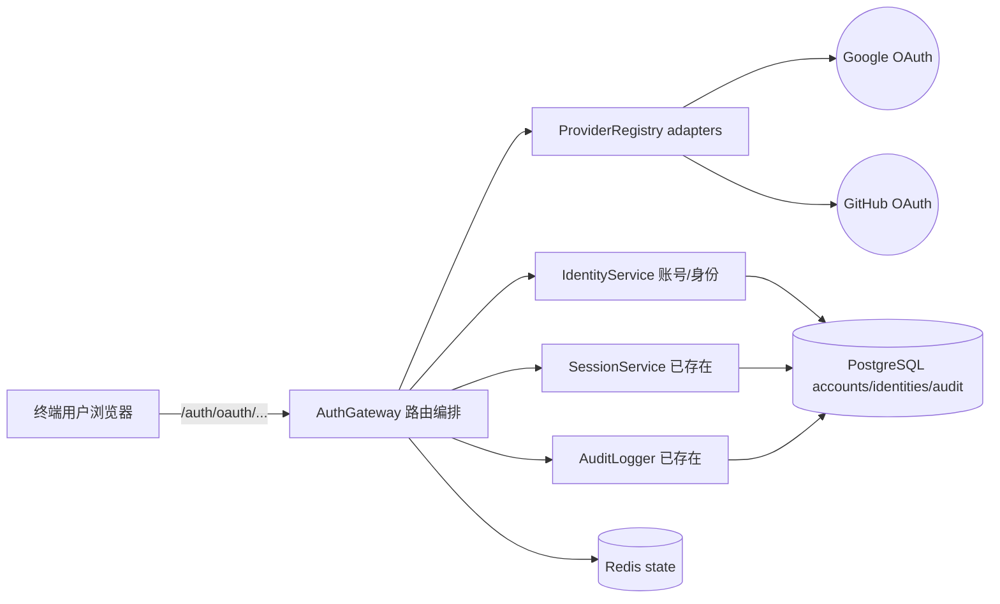
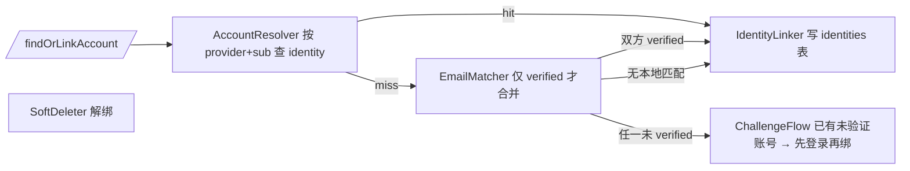
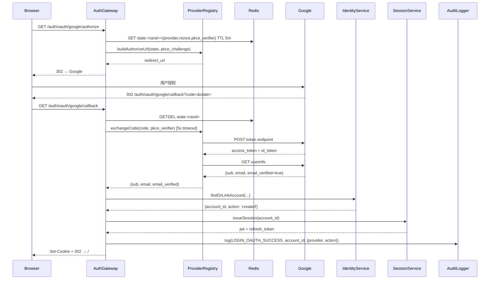
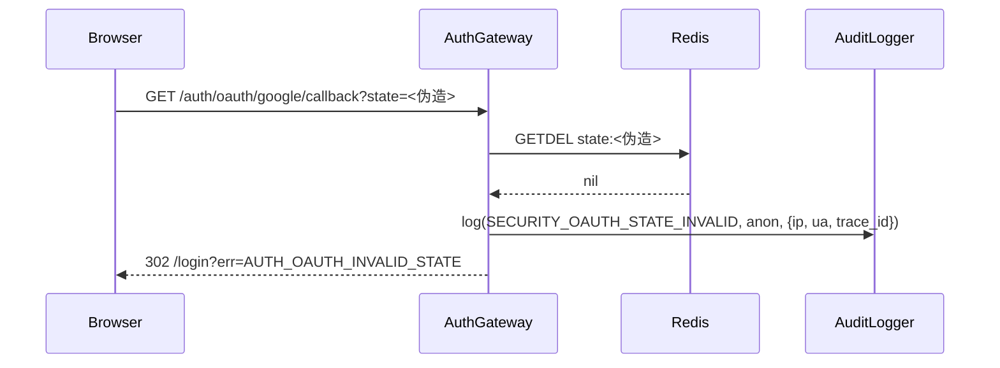

# 第三方 OAuth 登录(Google + GitHub)集成方案

> 文档状态:Draft
> 作者:arc42-spec skill(validation run)
> 日期:2026-04-27
> 适用范围:现有 SaaS 应用的认证模块
> 规模等级:L
> 相关材料:`SKILL.md`,`arc42-architecture.md`
>
> **说明**:本文档为 SKILL 验证样例。`context_pack` 来自合成上下文(本仓库无真实 SaaS 代码),所有"映射位置"为合成路径,真实项目使用时由 Phase C 从代码取证。

## 修订记录

| 日期 | 变更摘要 | 触发需求 |
| --- | --- | --- |
| 2026-04-27 | 初版 | 加 OAuth 第三方登录(Google + GitHub) |

## 评审清单

- [ ] 第 1 章目标可验证、相关方齐全
- [ ] 第 2 章约束含影响列
- [ ] 第 3 章边界清晰、外部接口含质量要求
- [ ] 第 4 章策略映射 1.4 质量目标与第 2 章约束
- [ ] 第 5 章 ≥1 处图、Level 1 含映射位置
- [ ] 第 6 章主路径 + 关键异常路径
- [ ] 第 7 章构建块到部署单元映射齐全
- [ ] 第 8 章 ≥3 项横切,每项 ≥3 条规则
- [ ] 第 9 章 ≥3 条 ADR,每条 Negative Consequences ≥1
- [ ] 第 10 章每条 1.4 质量目标至少 1 条场景
- [ ] 第 11 章 P0 / P1 风险均有 owner + 验证方式
- [ ] 第 12 章覆盖所有缩写

---

## 1. 引言与目标

### 1.1 背景与问题

现有 SaaS 应用仅支持邮箱密码登录。两类反馈持续累积:

第一,新用户摩擦明显——注册需邮箱+密码+邮箱验证三步,转化率低于行业基线。运营数据显示注册流失主要发生在密码创建与邮箱验证两步。

第二,部分企业客户和个人用户期望使用其已有的 Google 或 GitHub 账号一键登录;部分销售线索因此终止。安全 owner 同时希望降低用户密码记忆负担、减少与密码相关的钓鱼攻击面。

本方案在不破坏现有邮箱密码登录的前提下,新增 Google 和 GitHub 两个 OAuth 2.0 提供商,允许新用户用第三方账号注册、已有用户在账户设置中绑定 / 解绑第三方账号,并确保同一邮箱不会被拆成多个本地账号。

### 1.2 目标

- 支持 Google 和 GitHub OAuth 2.0 登录(Authorization Code + PKCE)
- 已注册用户可在账户设置中绑定 / 解绑任意 provider
- 新用户从 OAuth 注册后,允许后续补充密码以启用邮箱密码登录
- 同一已验证邮箱的多渠道登录归属同一 account,不创建重复账号
- 新增 OAuth provider 时,核心账号模型与登录主流程不需修改
- 现有邮箱密码登录用户行为零变更

### 1.3 非目标

- 不支持 SAML / OIDC 企业 SSO(下个 RFC)
- 不支持 account-to-account 合并(用户已有两个本地账号合并为一)
- 不支持 Apple / Microsoft / Twitter / WeChat 等其他 provider(未来通过 ADR-003 扩展点接入)
- 不在原生移动端实现 OAuth 流程(v1 仅 web,移动端通过 webview 复用)

### 1.4 质量目标

| 优先级 | 质量目标 | 可验证场景 |
| --- | --- | --- |
| P0 | 安全:防 CSRF / state 伪造 / code 重放 | 攻击者构造任意 callback 请求,系统拒绝且写审计;state 单次使用 TTL ≤ 5 min |
| P0 | 一致性:同一已验证邮箱不创建重复账号 | 用户先邮箱注册并验证 alice@x.com,后用 Google(alice@x.com,verified)登录 → 落到同一 account_id |
| P1 | 性能:登录跳转 p95 ≤ 2s | OAuth 完整往返(从用户授权到拿到 session cookie)p95 < 2 s |
| P1 | 可演进性:新增 provider 改动 ≤ 200 行核心模块 | 新接入 Apple OAuth 的 PR,核心模块变更 ≤ 200 行(provider adapter 自身可独立 ≤ 500 行) |
| P1 | 可观测性:登录失败可定位 | 任一登录失败可通过 trace_id 串联 audit + log + 指标,定位时间 < 5 min |

### 1.5 相关方

| 相关方 | 关注点 | 需要从文档获得什么 |
| --- | --- | --- |
| 终端用户 | 登录速度、是否需重设密码、UI 行为变化 | §6.1 主流程描述、§1.3 非目标 |
| 安全 owner | 信任边界、token / state 存储、回调劫持、数据最小化 | §3.2 接口表、§6.2 异常路径、§8.1 安全规则、ADR-001/002 |
| SRE / 运维 | 外部依赖故障对登录的影响、监控指标、灰度方式 | §6.3 启动 / 升级、§7 部署视图、§10 质量场景 |
| 客户成功 / 销售 | 何时可对外宣布、是否覆盖关键客户场景 | §1.2 目标、§1.3 非目标、§11.1 风险 |
| 后端开发 | 数据模型变更、错误处理、测试边界 | §5 构建块、§3.2 接口、§8 横切、ADR-001 |
| 前端开发 | callback 路由、绑定 UI、错误码映射 | §3.2 接口、§6.1 / 6.2 时序 |
| 数据 / 合规 | identity 数据生命周期、删除流程 | §8.6、§11 风险、ADR-001 |

---

## 2. 架构约束

| 类型 | 约束 | 影响 |
| --- | --- | --- |
| 技术 | 现有栈 Node.js 18 + Express + PostgreSQL 14 + JWT(jsonwebtoken) | OAuth 库选型必须与 Express 中间件兼容(passport-google-oauth20 / passport-github2);不引入新 ORM |
| 技术 | 现有 JWT 30 天 TTL + httpOnly cookie refresh token | OAuth 登录成功后必须复用 SessionService,不引入新 token 模型,否则前端逻辑要二次改 |
| 运行环境 | AWS ECS,出站经 NAT;OAuth provider 端点为 HTTPS | provider 调用受 NAT 故障窗口影响;callback handler 不允许长链路并发同步调多个 provider 端点 |
| 合规 | GDPR — 用户可删除关联第三方身份 | identity 必须软删除留审计;解绑立即生效不影响其他登录方式 |
| 合规 | 数据最小化 — 只能存必要 OAuth 字段 | 不持久化 access_token / refresh_token;只存 (provider, sub, email, email_verified) |
| 组织 | 安全 owner 强制评审认证类变更 | §6.2 异常路径与 §8.1 横切规则必须在合并前过安全 owner |
| 流程 | 上线走灰度(feature flag 5% / 25% / 100%) + AB 监控登录成功率 | §6.3 升级路径需明示灰度切换点;§10 必须有可观测的登录成功率场景 |
| 资源 | 不引入新数据库 / 缓存系统;state 短期存储复用现有 Redis | state 不能用 cookie,只能放 Redis,5 分钟 TTL,见 ADR-002 |
| 约定 | 错误码沿用 `AUTH_xxxx`;URL kebab-case;DB snake_case | 路由 `/auth/oauth/<provider>/{authorize,callback}`;表 `identities` |
| 约定 | 现有 audit log 写 PostgreSQL `audit_events` 表 | OAuth 登录、绑定、解绑、安全异常必须复用同表,不新增审计通道 |

---

## 3. 上下文与范围

### 3.1 系统边界

本系统继续作为 SaaS web 应用对外暴露(用户浏览器 + 同域 React 前端 + Express API)。OAuth 集成不改变系统对外角色,仅在原边界内新增对**外部身份提供商**的依赖。

边界要素清单:

- 系统**提供**:登录 / 注册 / 会话管理 / 账户设置(绑定 / 解绑 OAuth)
- 系统**不提供**:OAuth provider 自身的认证逻辑(委托给 Google / GitHub)
- 系统**消费**:Google OAuth 2.0 endpoint、GitHub OAuth 2.0 endpoint(仅用于一次性 code 交换 + userinfo 拉取,不长期持有 access_token)
- 系统**不消费**:第三方 IdP 的其他 API(Google Calendar、GitHub repos 等)

### 3.2 外部参与者与接口

| 外部对象 | 类型 | 输入 | 输出 | 接口 / 通道 | 质量要求 |
| --- | --- | --- | --- | --- | --- |
| 终端用户(浏览器) | 用户 | 登录请求、授权回调、绑定 / 解绑操作 | session cookie、错误页、绑定状态 | HTTPS + same-site cookie;`POST /auth/login`、`GET /auth/oauth/<provider>/authorize`、`GET /auth/oauth/<provider>/callback`、`POST /me/identities`、`DELETE /me/identities/:id` | 跳转 p95 ≤ 2s;CSRF 防护;callback URL 严格匹配 |
| Google OAuth Endpoint | 外部 API | client_id, redirect_uri, scope, state, code_challenge | code、access_token、id_token、userinfo | HTTPS;`accounts.google.com/o/oauth2/v2/auth`、`oauth2.googleapis.com/token`、`openidconnect.googleapis.com/v1/userinfo` | 5s 超时;失败可降级提示;不持久化 token |
| GitHub OAuth Endpoint | 外部 API | client_id, redirect_uri, scope, state | code、access_token、user / emails | HTTPS;`github.com/login/oauth/authorize`、`github.com/login/oauth/access_token`、`api.github.com/user`、`api.github.com/user/emails` | 同上;邮箱可能 private,需调 `/user/emails` |
| 邮件服务(已存在) | 服务 | 模板 + 收件人 + 模板变量 | 发送结果 | 内部 Queue + SMTP relay | 异步;失败重试 3 次;补充密码邀请邮件 24h TTL |
| Redis(已存在) | 存储 | state key + payload | get / del | 内网 TLS | state TTL ≤ 5 min;单实例 SLA 已由 SRE 保证 |
| PostgreSQL(已存在) | 存储 | identities / accounts / audit_events 表读写 | rows | 内网 + RDS Proxy | 写一致;支持 (provider, sub) 唯一索引 |
| audit_events(同库) | 存储 | event_type / actor / target / context | row | 同上 | 必写,失败则登录路径整体失败 |

### 3.3 范围内

- web 端 Google + GitHub OAuth 登录 / 注册 / 绑定 / 解绑
- 已存在用户从账户设置绑定第三方账号
- 新用户从 OAuth 注册后补充密码以启用邮箱密码登录
- audit + 监控指标 + 灰度切换
- E2E 测试 + 安全测试覆盖 §6.2 全部异常路径

### 3.4 范围外

- 原生移动端 OAuth SDK 集成(v1 仅 web)
- 多 OAuth 账号合并(同 provider 多 sub 绑同 account)
- 企业 SAML / OIDC SSO
- Apple / Microsoft / Twitter / WeChat 等其他 provider

---

## 4. 解决方案策略

| 质量目标 / 约束 | 解决方案策略 | 细节位置 |
| --- | --- | --- |
| P0 安全 | OAuth 2.0 Authorization Code + PKCE;state 服务端 Redis 一次性消费;callback redirect_uri 严格白名单;失败统一进 audit `SECURITY` 通道 | §6.1, §6.2, §8.1, ADR-002 |
| P0 一致性(同邮箱不重复) | identity 与 account 分离;email 作为合并键(仅在双方均 verified 时合并);未验证邮箱走 ChallengeFlow | §5.2, §6.2, ADR-001 |
| P1 性能 | callback 主路径仅做 token 交换 + userinfo + identityResolve + JWT 签发;副作用异步;provider 调用 5s 超时 + 1 次重试 | §6.1, §8.5 |
| P1 可演进性 | 抽象 `IOAuthProvider` 接口 + ProviderRegistry;Google / GitHub adapter 实现该接口;主流程不感知具体 provider | §5.2, ADR-003 |
| P1 可观测性 | 全链路 trace_id 贯穿 callback → identityResolve → SessionService → audit;指标见 §8.3 | §8.3 |
| 技术约束(JWT / Express) | 复用 SessionService 签发 JWT,不新增 token 模型 | §5.1 |
| 运行环境约束(AWS NAT / 超时) | 5s 上游超时;熔断打开后 fail-fast;不在主路径并发调多个 provider | §6.2 |
| 合规约束(GDPR / 数据最小化) | identity 软删除 + 解绑事件审计;只存必要字段;不持久化 access_token | §5.2, §8.6, ADR-001 |
| 组织约束(安全评审) | PR 中明确 §6.2 + §8.1 + ADR-001/002 三处链接,触发安全 owner 评审 | §6.2, §8.1 |
| 流程约束(灰度) | feature flag `oauth_login_enabled` + 按 client cookie hash 5% / 25% / 100% 切换 | §6.3, §7.1 |
| 资源约束(无新存储) | state 用现有 Redis;identities 表加在主库 | §7 |
| 约定约束(错误码 / URL) | 错误码 `AUTH_OAUTH_xxxx`;URL `/auth/oauth/<provider>/{authorize,callback}` | §8.2 |

---

## 5. 构建块视图

### 5.1 Level 1:整体系统



| 名称 | 职责 | 对外接口 | 依赖 | 质量要求 | 映射位置 | 风险 |
| --- | --- | --- | --- | --- | --- | --- |
| AuthGateway | OAuth 路由编排:authorize 跳转、callback 处理、错误映射、绑定 / 解绑端点 | `GET /auth/oauth/<provider>/authorize`、`GET /auth/oauth/<provider>/callback`、`POST /me/identities`、`DELETE /me/identities/:id` | ProviderRegistry、IdentityService、SessionService、AuditLogger、Redis | callback 主路径 ≤ 2s p95;严格 redirect_uri 白名单 | `src/auth/oauth/gateway.ts` | 主流程承载安全关键逻辑;任何 bypass 都是 P0 |
| IdentityService | 账号 / 身份解析与合并;识别"已存在邮箱"分支;identity 软删除 | `findOrLinkAccount({provider,sub,email,email_verified}) → {account_id,action}`、`unlinkIdentity(account_id,identity_id)`、`listIdentities(account_id)` | PostgreSQL | 写一致(单事务);唯一约束 (provider, sub) | `src/auth/identity/service.ts`、`src/auth/identity/repo.ts`、表 `identities` | 合并策略偏离 ADR-001 → 账号被劫持 / 用户卡死 |
| ProviderRegistry | 抽象 `IOAuthProvider` 接口 + Google / GitHub adapter | `IOAuthProvider.buildAuthorizeUrl(state,pkce)`、`exchangeCode(code,verifier)`、`fetchUserInfo(token) → {sub,email,email_verified}` | 调外部 IdP | 5s 超时 + 1 次重试;熔断打开 fail-fast | `src/auth/oauth/providers/{google,github,registry}.ts` | 新增 provider 时未实现完整接口 → callback 崩 |
| SessionService(已存在) | 签发 / 校验 JWT,管理 refresh token | `issueSession(account_id)`、`validateSession(jwt)` | PostgreSQL | 沿用现有 SLA | `src/auth/session/service.ts`(已存在,本方案不改) | 不能为 OAuth 特例化,否则破坏现有流 |
| AuditLogger(已存在) | 写 audit_events | `log(eventType, actor, target, context)` | PostgreSQL | 同步写,失败 → 路由整体失败 | `src/audit/logger.ts`(已存在) | SECURITY 事件需告警分级,避免淹没真实信号 |

### 5.2 Level 2:IdentityService(最高风险构建块)



| 子构件 | 职责 | 关键策略 |
| --- | --- | --- |
| AccountResolver | 按 (provider, sub) 唯一索引查现有 identity | 命中即返回 account_id,O(1) |
| EmailMatcher | 决定是否按 email 合并 | 见 §5.3 |
| ChallengeFlow | 任一侧未验证 → 走"先登录已有账号再绑定"流程 | 临时 challenge_token TTL 10 min,绑定路径在已登录态完成 |
| IdentityLinker | 单事务写 identity + audit | 失败 rollback |
| SoftDeleter | 解绑:`identities.deleted_at = now()` | 不真删;查询全部 `WHERE deleted_at IS NULL` |

### 5.3 Level 3:EmailMatcher(L 等级要求,最高风险子构件)

```
function emailMatch(provider, sub, email, oauthEmailVerified):
  if oauthEmailVerified == false:
    return { mode: 'create_or_challenge_unverified' }
  acct = findAccountByEmailCI(email)
  if acct == null:
    return { mode: 'create_new' }
  if acct.email_verified == false:
    return { mode: 'challenge_local_unverified', account_id: acct.id }
  return { mode: 'auto_link', account_id: acct.id }
```

四种 mode 对应单元测试用例与 §6 中的运行时分支。

---

## 6. 运行时视图

### 6.1 主成功路径:Google OAuth 首次登录(新用户,邮箱不在系统)



数据形态:

- state payload `{provider:'google', nonce:<16B base64>, pkce_verifier:<43-128B>, created_at:<epoch>}`
- userinfo 仅取 `sub`、`email`、`email_verified`,丢弃 `name / picture / locale`(见 §8.6)
- audit context `{provider, action, ip, ua, trace_id}`

### 6.2 关键异常路径

#### 异常 A:state 不匹配 / 缺失 / 已被消费(防 CSRF + 重放)



- 不签发任何 cookie,不创建任何 identity
- 错误码 `AUTH_OAUTH_INVALID_STATE`,前端显示通用提示
- 同 IP 1 分钟内 ≥ 5 次该错误 → 触发告警(SRE + 安全 owner)

#### 异常 B:OAuth provider 超时或不可用

- `exchangeCode` 5s 超时 / 上游 5xx
- AuthGateway:audit `OAUTH_PROVIDER_UNAVAILABLE`,302 `/login?err=AUTH_OAUTH_PROVIDER_DOWN`,UI 提示"暂时无法使用 Google 登录,请改用邮箱密码或稍后重试"
- **不重试 callback**(用户已持有一次性 code,过期了让用户重来)
- 指标 `oauth_provider_error_total{provider,phase=token_exchange}` 升高 → 告警

#### 异常 C:邮箱匹配但任一侧未验证(ChallengeFlow)

- IdentityService 返回 `mode: 'challenge_local_unverified'`
- AuthGateway 不签发 session;302 `/login/challenge?provider=google&token=<challenge_jwt 10min>`
- 页面要求用户用本地账号登录;成功后调 `POST /me/identities/link` 完成绑定
- audit `OAUTH_LINK_CHALLENGE_TRIGGERED`

#### 异常 D:同一 (provider, sub) 已绑到不同 account(兜底)

- IdentityLinker DB 唯一约束冲突
- AuthGateway:audit `OAUTH_IDENTITY_CONFLICT`(SECURITY 通道);302 `/login?err=AUTH_OAUTH_CONFLICT`
- 触发安全告警人工介入

### 6.3 启动 / 停止 / 升级 / 恢复

- **启动**:provider client_id / secret 从 SSM Parameter Store 加载;启动失败硬性 fail(不允许部分 provider 失败而部分成功)
- **灰度上线**:feature flag `oauth_login_enabled`(0% → 5% → 25% → 100%,按 client cookie hash 切),flag off 时 `/auth/oauth/*` 返回 404
- **secret 轮换**:新旧两套 secret 同时配置 24h 重叠期;ProviderRegistry 优先用新 secret,失败 fallback 旧 secret 并告警
- **identities 表迁移**:`CREATE TABLE` + 索引使用 `CONCURRENTLY` 在线创建,零停机
- **回滚**:flag off 即可;已创建的 identity 不删除,后续重试上线时复用

---

## 7. 部署视图

### 7.1 运行环境

| 环境 | 资源 | 配置差异 | 外部依赖 | 流量 |
| --- | --- | --- | --- | --- |
| dev | 单进程本地 | mock OAuth server(本地 Docker) | mock | 开发流量 |
| CI | GitHub Actions runner | mock OAuth server | mock | 集成测试 |
| staging | ECS Fargate × 2 task | 真实 Google / GitHub(staging client_id) | 真实(staging 配额) | 内部测试 |
| prod | ECS Fargate × 6 task(autoscale 6–20) | 真实 prod client_id | 真实 | 生产 |

### 7.2 部署单元

| 部署单元 | 打包形式 | 运行形态 | 扩缩容方式 | 资源预算 |
| --- | --- | --- | --- | --- |
| monolith-api(已存在) | Docker image,Node 18 | ECS Fargate task | CPU > 70% 触发 scale | 1 vCPU / 2 GB / task |
| Redis(已存在) | ElastiCache Redis 7 | 主从 + 故障切换 | 容量上限固定 | 共享;本方案 state 占用 < 1 MB |
| PostgreSQL(已存在) | RDS PostgreSQL 14 | Multi-AZ | 共享 | identities 预估 1 行 / 用户,< 10 MB / 100k 用户 |
| feature flag service(已存在) | 共享配置中心 | - | - | - |

### 7.3 构建块到部署单元映射

| 构建块 | 部署单元 | 环境 | 说明 |
| --- | --- | --- | --- |
| AuthGateway | monolith-api | 全部 | 同进程,新增 router |
| IdentityService | monolith-api | 全部 | 同进程,新增模块 |
| ProviderRegistry | monolith-api | 全部 | 同进程,新增模块 |
| SessionService | monolith-api | 全部 | 已存在,不改 |
| AuditLogger | monolith-api | 全部 | 已存在,不改 |
| Redis state store | ElastiCache | 全部 | key 前缀 `oauth_state:` |
| identities 表 | RDS PostgreSQL | 全部 | 主库,迁移脚本 V42 |
| audit_events 表 | RDS PostgreSQL | 全部 | 已存在,新增 event_type 枚举 |

---

## 8. 横切概念

### 8.1 安全

- **MUST**:OAuth Authorization Code 流程必须使用 PKCE(`code_challenge_method=S256`)
- **MUST**:state 服务端 Redis 存储,GETDEL 一次性消费,TTL ≤ 5 min;严禁存 client cookie
- **MUST**:redirect_uri 严格匹配预注册白名单(协议 + 域名 + 路径,不允许通配)
- **MUST**:不持久化 provider 的 access_token / refresh_token;仅一次性用于拉 userinfo
- **MUST**:任何 SECURITY 类 audit 失败 → 整个登录路径 fail-closed
- **SHOULD**:client_secret 通过 SSM 读取,运行时缓存 5 min,自动 reload
- **SHOULD**:同 IP / 同 fingerprint 1 分钟 OAuth 失败 ≥ 5 次 → rate-limit
- **DON'T**:不要把 sub / email 直接写到错误 URL query(避免日志泄露)
- **DON'T**:不要将 OAuth 错误细节透传给前端用户(用通用错误码 `AUTH_OAUTH_xxxx`)

### 8.2 错误处理与恢复

- **MUST**:错误码集合 `AUTH_OAUTH_INVALID_STATE` / `AUTH_OAUTH_PROVIDER_DOWN` / `AUTH_OAUTH_LINK_CHALLENGE` / `AUTH_OAUTH_CONFLICT` / `AUTH_OAUTH_USER_DENIED`
- **MUST**:每个错误码对应一条 audit;前端按错误码映射文案
- **SHOULD**:错误页面提供"切换到邮箱密码登录"快速入口
- **DON'T**:不在异常路径中调用未声明的副作用(异常路径不发邮件、不发 webhook)

### 8.3 日志、指标与追踪

- **MUST**:每次 callback 生成 `trace_id`,贯穿 `AuthGateway → ProviderRegistry → IdentityService → SessionService → AuditLogger`
- **MUST**:指标 `oauth_login_total{provider,result}`、`oauth_login_duration_seconds{provider}`、`oauth_provider_error_total{provider,phase}`、`oauth_state_invalid_total`
- **MUST**:audit 事件 `LOGIN_OAUTH_SUCCESS / FAILURE`、`OAUTH_LINK_CREATED / REMOVED`、`OAUTH_LINK_CHALLENGE_TRIGGERED`、`SECURITY_OAUTH_STATE_INVALID`、`OAUTH_IDENTITY_CONFLICT`
- **SHOULD**:Grafana dashboard 含成功率(目标 > 99%)、p95 时延(< 2s)、provider 错误率
- **DON'T**:不在普通日志中打印 access_token / id_token / code / state 值;仅打印 hash 前缀 8 字符

### 8.5 并发、资源与超时

- **MUST**:provider 调用 5s 超时,1 次重试,熔断打开后 fail-fast
- **MUST**:同 trace_id 内 provider 调用最多并发 1(避免 callback 内 fan-out)
- **SHOULD**:Redis 调用 200ms 超时
- **DON'T**:不在 callback 中触发同步邮件 / webhook(必须异步队列)

### 8.6 数据一致性与最小化

- **MUST**:identities 表 (provider, sub) 唯一约束;(account_id, provider) 唯一约束(每 account 每 provider 仅一条 identity)
- **MUST**:email 比较 case-insensitive(`LOWER(email)`);全部归一化存储
- **MUST**:解绑 → soft delete (`deleted_at`);全部查询附加 `WHERE deleted_at IS NULL`
- **MUST**:仅存 `(provider, sub, email, email_verified, linked_at, deleted_at)`;不存 name / picture / 其他 claim
- **SHOULD**:identities 表加 `last_login_at` 列辅助账号活跃度分析
- **DON'T**:不要让 IdentityService 之外的模块直接写 identities 表

---

## 9. 架构决策

### ADR-001:同邮箱合并策略 — 仅在双方均"邮箱已验证"时自动合并

- **Status**:Proposed
- **Context**:OAuth 提供商可能返回 `email_verified=true/false`,本地账号也可能尚未完成邮箱验证。若不限制合并,攻击者可注册一个未验证邮箱 X,而后受害者用其真实 Google 账号(同邮箱)登录时被强制合并到攻击者账号 → 账号劫持。若完全不合并,合法用户会得到"邮箱被占用"的困惑提示。
- **Decision**:
  - 仅当 `oauth.email_verified == true && local_account.email_verified == true` 时自动合并
  - 任一侧未验证 → 走 ChallengeFlow:用户先登录本地账号,在已登录态下显式绑定
  - 完全无本地账号 → 创建新 account,`email_verified` 取 oauth 的值(传递信任)
  - 被驳回 A:**任意 email 命中即自动合并** — 不选,存在账号劫持风险
  - 被驳回 B:**永不合并,同邮箱允许两个 account** — 不选,与 1.4 P0 一致性目标冲突,造成数据 / 计费分裂
- **Consequences**:
  - Positive:严格防止账号劫持,符合 P0 一致性目标
  - Positive:符合 GDPR / 数据最小化(无主动合并未授权数据)
  - Negative:邮箱未验证用户首次 OAuth 登录会有额外一步 challenge,转化率轻微下降
  - Negative:运营客服可能收到"为什么我用 Google 登录还要先输密码"的咨询
  - Neutral:Challenge 需要前端额外页面

### ADR-002:state 存 Redis 而非 cookie

- **Status**:Proposed
- **Context**:state 用于防 CSRF + 防 code 重放,需要服务端可一次消费后失效。两种主流实现:cookie(无服务端存储)与服务端存储(Redis / DB)。cookie 方案需要双重提交 + 签名,且无法严格"一次性消费",CSRF 防护强度较弱;服务端存储则简单清晰。约束 §2 指出可复用现有 Redis。
- **Decision**:
  - `/authorize` 阶段生成 16B 随机 → SET Redis key `oauth_state:<rand>` payload=`{provider,nonce,pkce_verifier,created_at}` TTL=5min
  - callback 阶段 GETDEL 一次性消费;失败即拒绝
  - 被驳回 A:**Signed cookie state** — 不选,无法严格一次性,且 CSRF 防护依赖 same-site,与现有 cookie 策略耦合更强
  - 被驳回 B:**JWT-encoded state** — 不选,JWT 一次性失效需要 revocation list,反而更复杂
- **Consequences**:
  - Positive:CSRF + 重放防护强,实现简单
  - Positive:复用现有 Redis,无新依赖
  - Negative:Redis 不可用时 OAuth 登录直接 fail(已通过 §6.2 异常 B + 邮箱密码兜底缓解)
  - Negative:增加 1 次 Redis 往返(SET + GETDEL),通常 < 2ms,可接受

### ADR-003:抽象 IOAuthProvider 接口而非每 provider 独立 router

- **Status**:Proposed
- **Context**:Google 与 GitHub OAuth 流程相似但细节不同(GitHub 邮箱可能 private 需调 `/user/emails`;Google 提供 OIDC `id_token` 而 GitHub 不提供)。两种思路:(a) 每个 provider 独立 router / controller;(b) 抽象统一接口 + adapter。
- **Decision**:
  - 定义 `IOAuthProvider`:`buildAuthorizeUrl(state, pkce)`、`exchangeCode(code, pkce_verifier)`、`fetchUserInfo(token) → {sub, email, email_verified}`
  - Google 与 GitHub 各实现一份 adapter,差异(如 GitHub `/user/emails`)封装在 adapter 内部
  - AuthGateway 通过 ProviderRegistry 按 path 参数 `<provider>` 查找 adapter,主流程不感知 provider
  - 被驳回 A:**每 provider 独立 router** — 不选,新增 provider 时核心模块要修改,违反 1.4 P1 可演进性目标
  - 被驳回 B:**直接用 passport 全部委托** — 不选,passport 与本系统 SessionService 集成不深,且测试与控制面较弱
- **Consequences**:
  - Positive:新增 provider 影响范围 ≤ 200 行(满足 1.4 P1)
  - Positive:测试可独立 mock IOAuthProvider
  - Negative:抽象层增加 ~150 行模板代码
  - Negative:接口稳定性需要前期设计,后续若加 SAML 可能需扩接口或独立通路

### ADR-004:v1 不支持 account-to-account 合并

- **Status**:Accepted
- **Context**:用户可能在系统中已有两个独立 account(如分别用 alice@x.com 和 alice.work@x.com 注册)。OAuth 登录时若 Google 返回的邮箱命中其中一个,另一个 account 仍然独立存在。"账号合并"涉及订单、数据、订阅、权限的迁移,复杂度高且存在数据丢失风险。
- **Decision**:
  - v1 仅支持单 account 与多 identity 关联,不实现 account-to-account 合并
  - 用户若需合并 → 客服工单走人工流程
  - 被驳回 A:**自动合并所有命中邮箱的 account** — 不选,极高风险,可能误合并造成不可逆数据混乱
- **Consequences**:
  - Positive:v1 复杂度大幅降低,数据安全性高
  - Negative:少量用户会困惑(已通过 1.3 非目标显式声明)
  - Neutral:为 v2 留扩展点(如 `POST /me/account/merge` 接受同邮箱另一 account 的确认凭证)

---

## 10. 质量要求

| 场景 | 背景 | 刺激 | 响应 | 指标 | 优先级 |
| --- | --- | --- | --- | --- | --- |
| OAuth state 防伪 | 用户在公网,攻击者构造任意 callback | 任意 state 不存在或已被消费 | 拒绝 + audit `SECURITY_OAUTH_STATE_INVALID` + 不签发 cookie | state TTL ≤ 5 min;同 IP 1 min 内 ≥ 5 次失败触发告警 | P0 |
| 同邮箱不重复 | alice@x.com 已邮箱注册并验证 | alice 用 Google(alice@x.com,verified)登录 | 命中并合并到原 account_id;不创建新 account | account 总数不增 1;identities 表增 1 行 | P0 |
| 未验证邮箱不被劫持 | 攻击者用未验证邮箱注册 alice@x.com | alice 真用 Google(alice@x.com)登录 | 进入 ChallengeFlow,不自动合并;audit `OAUTH_LINK_CHALLENGE_TRIGGERED` | 0 起劫持;Challenge 触发率作为安全 KPI | P0 |
| 登录跳转 p95 | 正常生产流量 | 用户从点击 Google 按钮到拿到 session | callback 整体往返 | p95 ≤ 2s | P1 |
| 新增 provider 改动量 | 团队接入 Apple OAuth | 实现 IOAuthProvider 接口 + adapter | PR 影响范围 | 核心模块改动 ≤ 200 行;adapter ≤ 500 行 | P1 |
| 登录失败可定位 | 任一 OAuth 登录失败 | 用户报告"无法登录" | 工程师按 trace_id 串联 audit + log + 指标 | 定位时间 < 5 min | P1 |
| Provider 不可用兜底 | Google 端点 5xx 持续 1 min | 用户尝试 Google 登录 | 错误页提示;邮箱密码登录仍正常 | 邮箱密码登录成功率不受影响;OAuth 错误 audit 升高 | P1 |

---

## 11. 风险与技术债

### 11.1 风险

| 风险 | 触发条件 | 影响 | 缓解措施 | 验证方式 | Owner | 优先级 |
| --- | --- | --- | --- | --- | --- | --- |
| R-1 自动合并未验证邮箱致账号劫持 | 实现偏离 ADR-001 | P0 账号失窃 | 严格 ADR-001 策略 + EmailMatcher 单元测试覆盖 4 种 mode + 安全 owner code review 必过 | EmailMatcher 单测;§6.2 异常 C E2E;安全 owner sign-off | 安全 owner | P0 |
| R-2 Provider 端点不可用阻塞登录 | Google / GitHub OAuth 故障 | OAuth 路径不可用,部分用户无法登录 | 邮箱密码登录始终可用;UI 显式提示;5s 超时 + fail-fast | 故障演练:staging 屏蔽 Google 端点,验证 §6.2 异常 B 与 §10 兜底场景 | SRE | P1 |
| R-3 Redis 不可用使 state 无法存取 | Redis 故障 | OAuth 路径不可用 | OAuth 短期不可用回退到邮箱密码;Redis SLA 99.95%;告警立即触发 | 故障演练:断 Redis,验证 callback 直接 5xx + 监控告警 | SRE | P1 |
| R-4 client_secret 泄露 | SSM 误配 / 日志误打印 / 仓库误提交 | 攻击者可代行 OAuth 流程 | secret 仅在 SSM;§8.3 DON'T 禁止打印;CI secret scanner;轮换流程 24h 重叠期 | secret scanner 在 CI;季度轮换演练 | 安全 owner | P0 |
| R-5 identities 表写入热点 | 高并发首次登录 | 写延迟升高 | (provider, sub) 唯一约束 + 简单 upsert;PostgreSQL 行锁可承受;监控写延迟 | 压测 1k QPS callback,p95 写延迟 < 50 ms | 后端 lead | P2 |
| R-6 GitHub primary email private | 用户 GitHub 邮箱 private 且未授权 read:user:email | 拿不到邮箱无法合并 / 创建 | adapter 调 `/user/emails`;若全部 private → 提示用户授权或改用其他登录 | E2E 用 mock GitHub 模拟 | 后端 | P2 |
| R-7 灰度切换流量倾斜 | feature flag 未按预期分流 | 部分用户看到 OAuth 按钮但 backend 未启用 | 前端按 flag 渲染 + 后端路由也按 flag,两处一致 | staging 灰度演练 | 后端 + 前端 | P2 |

### 11.2 技术债

| 技术债 | 来源 | 影响 | 偿还条件 | 暂存原因 |
| --- | --- | --- | --- | --- |
| account-to-account 合并未实现 | ADR-004 | 少数已有双账号用户体验差 | 当客服相关工单 / 月 ≥ 10 时启动 v2 RFC | v1 复杂度风险大,先暴露真实需求 |
| Provider adapter 无熔断器 | v1 仅 5s 超时 + 1 次重试 | 长期持续故障时仍消耗资源 | 月度 `oauth_provider_error_total` 持续 > 0.5% | 引入熔断需选型,v1 暂用超时兜底 |
| 移动端 OAuth SDK 集成缺失 | 1.3 非目标 | 移动端用户无法享受 OAuth 优势 | 移动端 DAU 占比 > 30% 时启动 | 移动端架构改动大,优先 web 验证价值 |

---

## 12. 术语表

| 术语 | 含义 | 同义词 / 英文 | 出现位置 |
| --- | --- | --- | --- |
| OAuth 2.0 | 授权框架,本方案使用 Authorization Code + PKCE | OAuth | §1.2, §3.2, §6.1 |
| PKCE | Proof Key for Code Exchange,防止 code 被截获后被另一端使用 | RFC 7636 | §6.1, §8.1, ADR-002 |
| state | 防 CSRF / 重放的服务端一次性令牌 | - | §6.1, §8.1, ADR-002 |
| provider / IdP | 身份提供商,本方案指 Google 与 GitHub | Identity Provider | §3.2, §5 |
| sub | OAuth / OIDC 中提供商内用户的稳定唯一标识 | subject | §5, §6.1, §8.6 |
| account | 本系统内部用户实体(billing / data 主体) | 账号 | §5, §6, ADR-001 / 004 |
| identity | account 与 (provider, sub) 的绑定记录 | 身份关联 | §5, §6, ADR-001 |
| ChallengeFlow | 邮箱匹配但任一侧未验证时的"先登录再绑定"流程 | - | §5.2, §6.2, ADR-001 |
| audit_events | 现有审计事件表 | audit | §3.2, §8.3 |
| feature flag | 灰度 / 开关配置项 | flag | §6.3, §7, R-7 |
| SSM | AWS Systems Manager Parameter Store | - | §8.1, R-4 |
| RDS | AWS Relational Database Service | - | §3.2, §7 |
| ECS | AWS Elastic Container Service | - | §2, §7 |
